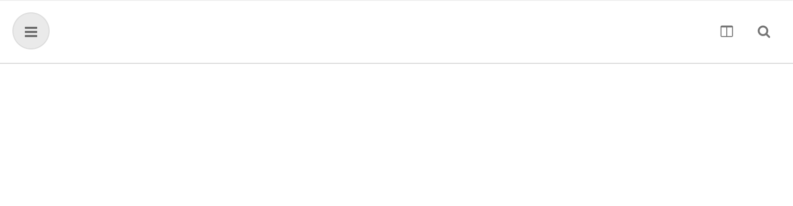
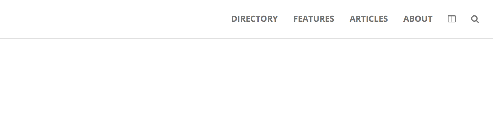

# Navigation

## Indications

- Fork this [pen](https://codepen.io/agzeri/pen/RQLjBb) to your profile.
- Hide all text option when you are on a mobile version.
- Add the necessary markup to create a circle icon like in the image.

**You may need to add an icon inside a link tag.**

**Hint: You can take advantage of positioning in CSS to align the icon.**

## Design Specs

```
Icon (bars)
  fill color: EAEAEA
  border color: rgba(0, 0, 0, 0.06)
  dimensions: 36 * 36
  to align it use 14px in the top and 12px to the left
  text color: rgba(0, 0, 0, 0.54)
```

## Final Result



